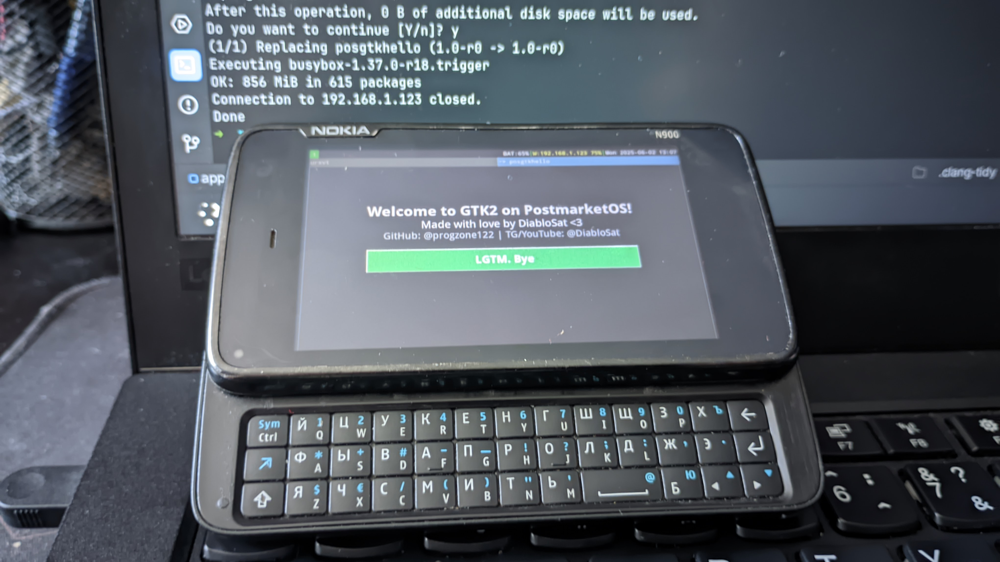

# posgtkhello 
Simple GTK2 C++ application template with a fully configured build system for PostmarketOS (with setup guide).

<div style="display: flex; flex-wrap: wrap;">
   
   
</div>

## Quick to start doing sh*t
### Preparing
1. Install pmbootstrap ([RTFM](https://wiki.postmarketos.org/wiki/Pmbootstrap/Installation))
2. Customize the pmbootstrap environment **FOR YOUR DEVICE**
> [!NOTE]
> If it possible, use default paths when initializing the environment.<br />Otherwise, you will have to configure the paths in the ```config.sh``` file
    ```shell
    pmbootstrap init
    ```
4. **Navigate to the pmaports directory** in the initialized environment and create a new directory.<br />
   The path ***for the “default” configuration*** is as follows:
    ```shell
    cd mkdir -p $HOME/.local/var/pmbootstrap/cache_git/pmaports
    mkdir -p community
    ```
5. Clone the template into the directory you created in the previous step
    ```shell
    cd community
    git clone https://github.com/progzone122/posgtkhello
    ```
### Build for the host system
You can test the app before you build it for a real device.
> [!NOTE]
> You may need additional packages for this section<br />
> ```shell
> sudo pacman -S cmake make g++ tar gzip
> ```
```shell
./build.sh
./build/posgtkhello
```

### Build for the actual device
1. Specify the correct device architecture in APKBUILD.<br />
   The device architecture can be obtained **from the PostmarketOS documentation** for the device **or from the terminal**.
   
   ```shell
   # File: APKBUILD
   ...
   arch="armhf"
   ...
   ```
2. Run the ```build.sh``` script with the ```--release``` argument<br />
   After this step, an **.apk package will be created** that will be ready to be installed in PostmarketOS
   ```shell
   ./build.sh --release
   ```
3. **Move the obtained .apk package** to your device by any means **and install it by allowing untrusted packages.**
   ```shell
   sudo apk add posgtkhello-1.0-r0.apk --allow-untrusted
   ```
   
4. Run the application
   ```
   posgtkhello
   ```
### Sideload
You'll **definitely love** using the ```sideload.sh``` script to **automatically upload the .apk package via ssh** directly to your device!

1. Connect the device to the same LAN, install the ```openssh``` package, and enable the ```sshd``` service ([RTFM](https://wiki.postmarketos.org/wiki/SSH))
2. Configure the settings for sideload in the ```config.sh``` file
   ```shell
   # File: config.sh
   ...
   # SSH sideload settings
   SSH_USER=user
   SSH_HOST=192.168.1.123
   SSH_PORT=22
   
   DIR_SIDELOAD="/home/$SSH_USER"  # <- Path where the package will be uploaded
   ...
   ```
3. Run the sideload.sh script and agree to automatically install the package via SSH

4. Run the application

   ```shell
   posgtkhello
   ```

### Sh*t done?
Close all pmbootstrap sessions
```shell
pmbootstrap shutdown
```

--------

Made with ❤️ [by DiabloSat](https://github.com/progzone122)
